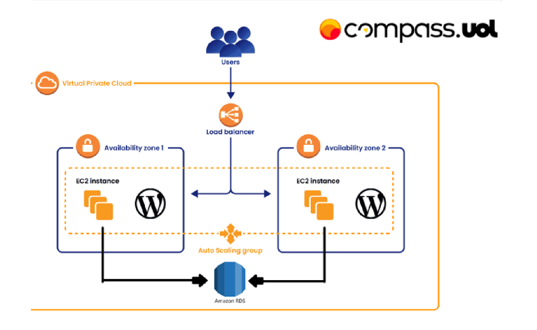
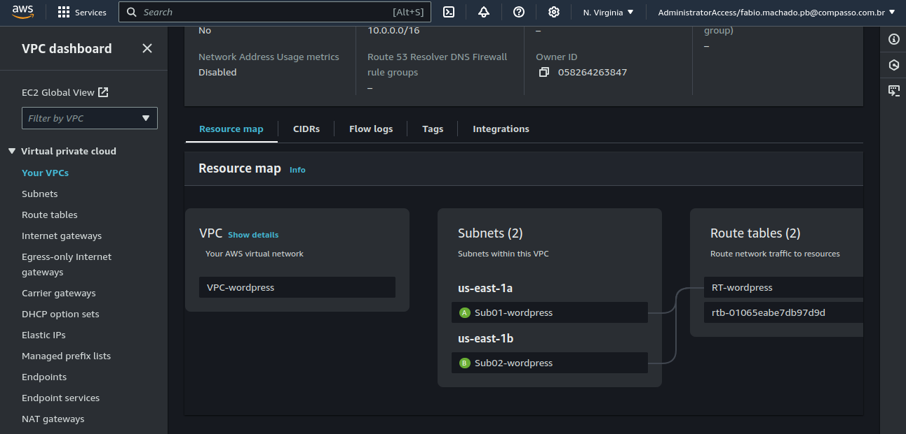
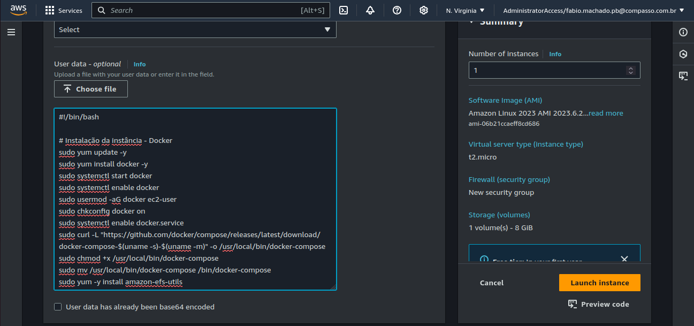
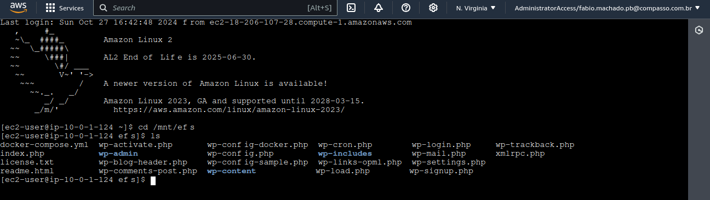
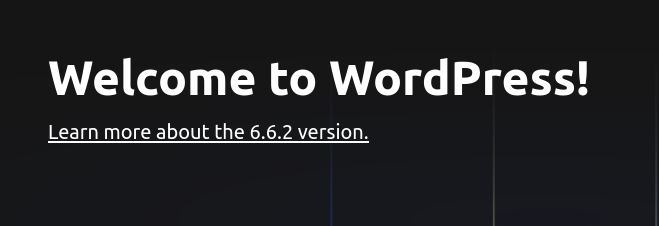
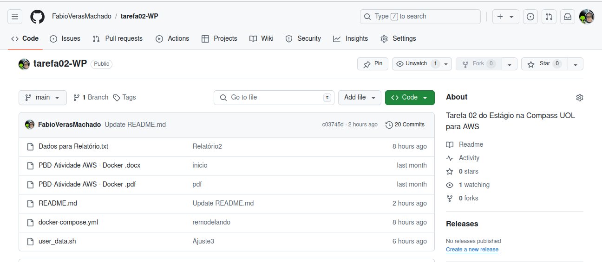

# tarefa02-WP
Tarefa 02 do Estágio na Compass UOL para AWS


# 🚀 Projeto VPC WordPress na AWS

## 📖 Descrição
Este projeto implementa uma arquitetura de hospedagem para uma aplicação **WordPress** utilizando a **AWS**. O sistema é configurado em uma **Virtual Private Cloud (VPC)** com sub-redes em diferentes zonas de disponibilidade. A solução inclui **Docker**, **Amazon RDS** para banco de dados, **Amazon EFS** para armazenamento de arquivos estáticos e um **Load Balancer** para gerenciar o tráfego HTTP.


---

## 📋 Passos de Execução da Tarefa 02 - Docker
1. **Criar e configurar a VPC**;
2. **Security Groups** - Criação;
3. **EC2 Linux AWS 2** - Criar e configurar a instância "CAMICASE";
4. **RDS** - Criar e configurar o Amazon Relational Database Service;
5. **EFS** - Criar e configurar Amazon Elastic File System;
6. **Criação do Template**;
7. **Auto Scaling**;
8. **Confirmar todos os procedimentos**, excluir "CAMICASE" e isolar a rede;
9. **ELB** - Criação do Elastic Load Balancer;
10. **Ajustes finais...**
11. **TESTES.**

---

## 🌐 Arquitetura
A arquitetura consiste em:
- **VPC**: Dividida em duas sub-redes (Zona 1 e Zona 2).
- **Instâncias EC2**: Cada sub-rede possui uma instância com um webserver configurado para rodar o WordPress.
- **RDS**: Utilização do Amazon RDS com MySQL para o armazenamento de dados do WordPress.
- **EFS**: Sistema de arquivos elástico (EFS) para armazenar arquivos estáticos do WordPress.
- **Auto Scaling**: Configuração para monitoramento e substituição automática de instâncias.
- **Load Balancer**: Distribui o tráfego de entrada e saída via HTTP.


---

## 🛠️ Tecnologias Utilizadas
- **AWS EC2**
- **AWS RDS (MySQL)**
- **AWS EFS**
- **AWS Elastic Load Balancer**
- **Docker / Docker Compose**

---

## ✅ Pré-requisitos
1. Conta na **AWS**.
2. Conhecimento básico de **Docker** e **AWS**.
3. Instalação do **AWS CLI** configurada.

---

## ⚙️ Instalação
### 1. Configuração da EC2
Utilize o seguinte script `user_data.sh` para automatizar a configuração das instâncias EC2, incluindo a instalação do Docker e Docker Compose:

```bash
#!/bin/bash

# Instalação da instância - Docker
sudo yum update -y
sudo yum install docker -y
sudo systemctl start docker
sudo systemctl enable docker
sudo usermod -aG docker ec2-user
sudo chkconfig docker on
sudo systemctl enable docker.service
sudo curl -L "https://github.com/docker/compose/releases/latest/download/docker-compose-$(uname -s)-$(uname -m)" -o /usr/local/bin/docker-compose
sudo chmod +x /usr/local/bin/docker-compose
sudo mv /usr/local/bin/docker-compose /bin/docker-compose
sudo yum -y install amazon-efs-utils
sudo mkdir /mnt/efs/
sudo chmod +rwx /mnt/efs/

# Executando contêineres via Docker Compose
sudo yum install git -y
cd /mnt/efs
git clone https://github.com/FabioVerasMachado/tarefa02-WP.git
cd tarefa02-WP

# Subir os contêineres
docker-compose up -d

# adicionar o EFS no fstab
echo "fs-0cc3a3c08279c9040.efs.us-east-1.amazonaws.com:/ /mnt/efs nfs4 defaults,_netdev,rw  0  0" >> /etc/fstab
# montar o EFS
cd /mnt/efs
sudo mount -a
```

### 2. Arquivo `docker-compose.yml`
Aqui está o conteúdo do arquivo `docker-compose.yml` utilizado para definir os serviços do WordPress e do banco de dados MySQL:

```yaml
version: '3.8'

services:
  wordpress:
    image: wordpress:latest
    restart: always
    ports:
      - 80:80
    environment:
      WORDPRESS_DB_HOST: db
      WORDPRESS_DB_USER: admin
      WORDPRESS_DB_PASSWORD: favema2190
      WORDPRESS_DB_NAME: db
    volumes:
      - /mnt/efs:/var/www/html

  db:
    image: mysql:8.0
    restart: always
    environment:
      MYSQL_DATABASE: db
      MYSQL_USER: admin
      MYSQL_PASSWORD: favema2190
      MYSQL_RANDOM_ROOT_PASSWORD: '1'
    volumes:
      - db:/var/lib/mysql

volumes:
  wordpress:
  db:
```

### 3. Deploy do WordPress
- O **WordPress** será executado em um container **Docker**.
- A base de dados será provisionada através do **Amazon RDS** com **MySQL**.
- O serviço de **EFS** será utilizado para armazenar arquivos estáticos do **WordPress**.

---



## 🔄 Configuração do Load Balancer
- Um **Load Balancer Classic** será configurado para gerenciar o tráfego HTTP.
- **Importante**: Evitar a exposição do IP público das instâncias. Todo o tráfego externo deve passar pelo Load Balancer.
---

## 🗂️ Estrutura do Projeto
A estrutura do projeto deve seguir o padrão de topologia fornecido, e é recomendável utilizar `Dockerfile` ou `Docker Compose` conforme a preferência do desenvolvedor.

---

## 🚀 Execução
1. Após a configuração, acesse a aplicação WordPress através do **Load Balancer** na porta **80** ou **8080**.
2. Verifique se a tela de login do WordPress está disponível.


---

## 📂 Versionamento
Todo o código e as configurações devem ser versionados utilizando um repositório **Git**.

---

## 🙏 Agradecimentos

Gostaria de expressar minha profunda gratidão à equipe de estagiários, cuja dedicação e esforço foram fundamentais para o sucesso deste projeto. O compartilhamento constante de conhecimentos e experiências entre nós fez toda a diferença na nossa evolução conjunta.

Agradeço também aos instrutores da **Compass UOL**, que nos proporcionaram valiosas orientações e apoio ao longo do caminho. Sem sua expertise e incentivo, não teríamos alcançado nossos objetivos.

Juntos, conseguimos superar desafios e aprender de forma colaborativa, tornando esta experiência ainda mais enriquecedora. Muito obrigado a todos!

---
### 🔗 Referências: 

- Deploy WordPress with Amazon RDS: https://aws.amazon.com/pt/getting-started/hands-on/deploy-wordpress-with-amazon-rds/module-one/
- WordPress | Docker Official Images: https://hub.docker.com/_/wordpress
- Curso Preparatório para o Exame Oficial atual SAA-C03: https://udemy.com/course/aws-ec2-masterclass](https://compassuol.udemy.com/course/certificacao-amazon-/
- BootCamp DevOps: https://compassuol.udemy.com/course/devops-bootcamp-trilha-de-aprendizado-rapido-all-in-one
- Deploy Dockerized WordPress with AWS RDS & AWS EFS: https://www.alphabold.com/deploy-dockerized-wordpress-with-aws-rds-aws-efs/
- https://github.com/CarolinaSFreitas/Atividade2-Docker/tree/main
- https://github.com/alexlsilva7/atividade_aws_docker/tree/main


