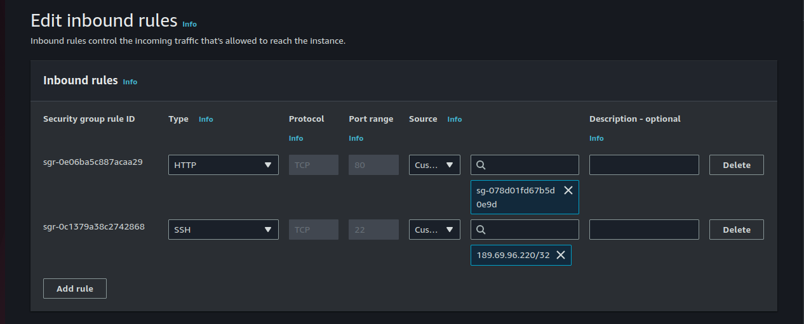
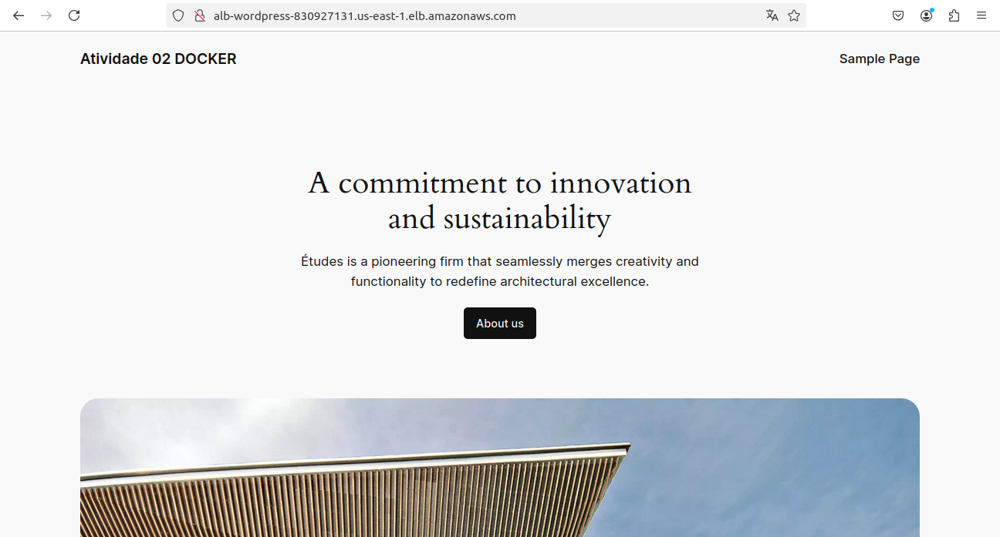

# Atividade Docker - AWS SENAC/UNICESUMAR 
Tarefa 02 do Estágio na Compass UOL para AWS


># 🚀 Projeto VPC WordPress na AWS

## 📖 Descrição
Este projeto implementa uma arquitetura de hospedagem para uma aplicação **WordPress** utilizando a **AWS**. O sistema é configurado em uma **Virtual Private Cloud (VPC)** com sub-redes em diferentes zonas de disponibilidade. A solução inclui **Docker**, **Amazon RDS** para banco de dados, **Amazon EFS** para armazenamento de arquivos estáticos e um **Load Balancer** para gerenciar o tráfego HTTP.


---

>## 📋 Passos de Execução da Tarefa 02 - Docker
Neste projeto, a arquitetura de rede foi desenhada com foco em segurança e eficiência. Embora o diagrama inclua um pequeno ícone de cadeado nas sub-redes, ele não representa uma rede privada, mas sim a implementação de medidas de proteção contra invasões externas. O tráfego HTTP é direcionado para o balanceador de carga (load balancer), enquanto a comunicação com as instâncias ocorre exclusivamente via protocolo SSH, restrita ao IP da minha máquina. Esse controle garante um isolamento eficaz e segurança aos servidores web, protegendo-os contra acessos não autorizados e reforçando a confiabilidade da rede.

1. **Criar e configurar a VPC**;
2. **Security Groups** - Criação;
3. **EC2 Linux AWS 2** - Criar e configurar a instância "CAMICASE" que servirá para testes e criação do Template;
4. **RDS** - Criar e configurar o Amazon Relational Database Service;
5. **EFS** - Criar e configurar Amazon Elastic File System;
6. **Template** - Como Criar um Template para Auto Scaling no AWS CloudFormation
7. **Auto Scaling** - Incluir **Load Balance** e incorporação do Template;
8. **Confirmar todos os procedimentos**;
9. **Ajustes finais...**
10. **ENTREGA.**
---

## 🌐 Arquitetura
A arquitetura consiste em:
- **VPC**: Dividida em duas sub-redes (Zona 1 e Zona 2).
- **Instâncias EC2**: Cada sub-rede possui uma instância com um webserver configurado para rodar o WordPress.
- **RDS**: Utilização do Amazon RDS com MySQL para o armazenamento de dados do WordPress.
- **EFS**: Sistema de arquivos elástico (EFS) para armazenar arquivos estáticos do WordPress.
- **Auto Scaling**: Configuração para monitoramento e substituição automática de instâncias.
- **Load Balancer**: Distribui o tráfego de entrada e saída via HTTP.

---

## 🛠️ Tecnologias Utilizadas
- **AWS EC2**
- **AWS RDS (MySQL)**
- **AWS EFS**
- **AWS Elastic Load Balancer**
- **Docker / Docker Compose**

---

## ✅ Pré-requisitos
1. Conta na **AWS**.
2. Conhecimento básico de **Docker** e **AWS**.
3. Instalação do **AWS CLI** configurada.

---

## ⚙️ Instalação

># 1- 🌐 Criar e configurar a VPC

Para criar e configurar uma VPC (Virtual Private Cloud) com duas sub-redes públicas, siga os passos abaixo:

1. **Criação da VPC**: No console da AWS, acesse o serviço VPC e selecione a opção para criar uma nova VPC. Defina o intervalo de IPs (CIDR) que atenderá às suas necessidades, por exemplo, 10.0.0.0/16, para permitir uma ampla gama de endereços IP.

2. **Configuração das Sub-redes Públicas**: Dentro da VPC, crie duas sub-redes públicas em zonas de disponibilidade diferentes para garantir alta disponibilidade. Atribua um intervalo de IP menor para cada sub-rede, como 10.0.1.0/24 para a primeira sub-rede e 10.0.2.0/24 para a segunda.

3. **Internet Gateway**: Para fornecer acesso à internet, crie um Internet Gateway e associe-o à VPC. Este recurso é essencial para permitir que instâncias em sub-redes públicas acessem e sejam acessadas pela internet.

4. **Route Table**: Crie uma tabela de rotas e adicione uma rota que direcione o tráfego de saída (0.0.0.0/0) para o Internet Gateway. Associe essa tabela de rotas às sub-redes públicas, garantindo que o tráfego de rede delas possa sair para a internet.

Essas etapas criam uma VPC com duas sub-redes públicas e conectividade externa, permitindo o acesso seguro à internet por meio do Internet Gateway.


># 2- Security Groups Configuração




Abaixo estão os Security Groups configurados para os diferentes serviços do projeto, com suas respectivas regras de entrada e saída para garantir segurança e isolamento adequado na comunicação entre os recursos.
## SG-RDS (Security Group para RDS) 📊

### Inbound Rules
- **MySQL/Aurora** (Porta **3306**) - Source: EC2 Security Group

### Outbound Rules
- **Todo o Tráfego** (0.0.0.0/0)

---

## SG-EFS (Security Group para EFS) 🗄️

### Inbound Rules
- **NFS** (Porta **2049**) - Source: EC2 Security Group

### Outbound Rules
- **Todo o Tráfego** (0.0.0.0/0)

---

## SG-EC2 (Security Group para EC2) 💻

### Inbound Rules
- **HTTP** (Porta **80**) - Source: Load Balancer Security Group  
- **SSH** (Porta **22**) - Source: Seu IP

### Outbound Rules
- **Todo o Tráfego** (0.0.0.0/0)

---

## SG-LoadBalance (Security Group para o Load Balancer) ⚖️

### Inbound Rules
- **HTTP** (Porta **80**) - Source: 0.0.0.0/0  
- **HTTPS** (Porta **443**) - Source: 0.0.0.0/0

### Outbound Rules
- **Todo o Tráfego** (0.0.0.0/0)


># 3- Criação e Configuração da EC2
Utilize o seguinte script `user_data.sh` para automatizar a configuração das instâncias EC2, incluindo a instalação do Docker e Docker Compose:

```bash
#!/bin/bash

# Instalação da instância - Docker
sudo yum update -y
sudo yum install docker -y
sudo systemctl start docker
sudo systemctl enable docker
sudo usermod -aG docker ec2-user
sudo chkconfig docker on
sudo systemctl enable docker.service
sudo curl -L "https://github.com/docker/compose/releases/latest/download/docker-compose-$(uname -s)-$(uname -m)" -o /usr/local/bin/docker-compose
sudo chmod +x /usr/local/bin/docker-compose
sudo mv /usr/local/bin/docker-compose /bin/docker-compose
sudo yum -y install amazon-efs-utils
sudo mkdir /mnt/efs/
sudo chmod +rwx /mnt/efs/

# Executando contêineres via Docker Compose
sudo yum install git -y
cd /mnt/efs
git clone https://github.com/FabioVerasMachado/tarefa02-WP.git
cd tarefa02-WP

# Subir os contêineres
docker-compose up -d

# adicionar o EFS no fstab
echo "fs-0cc3a3c08279c9040.efs.us-east-1.amazonaws.com:/ /mnt/efs nfs4 defaults,_netdev,rw  0  0" >> /etc/fstab
# montar o EFS
cd /mnt/efs
sudo mount -a
```

### Arquivo `docker-compose.yml`
Aqui está o conteúdo do arquivo `docker-compose.yml` utilizado para definir os serviços do WordPress e do banco de dados MySQL:

```yaml
version: '3.8'

services:
  wordpress:
    image: wordpress:latest
    restart: always
    ports:
      - 80:80
    environment:
      WORDPRESS_DB_HOST: db
      WORDPRESS_DB_USER: admin
      WORDPRESS_DB_PASSWORD: favema2190
      WORDPRESS_DB_NAME: db
    volumes:
      - /mnt/efs:/var/www/html

  db:
    image: mysql:8.0
    restart: always
    environment:
      MYSQL_DATABASE: db
      MYSQL_USER: admin
      MYSQL_PASSWORD: favema2190
      MYSQL_RANDOM_ROOT_PASSWORD: '1'
    volumes:
      - db:/var/lib/mysql

volumes:
  wordpress:
  db:
```

### Deploy do WordPress
- O **WordPress** será executado em um container **Docker**.
- A base de dados será provisionada através do **Amazon RDS** com **MySQL**.
- O serviço de **EFS** será utilizado para armazenar arquivos estáticos do **WordPress**.

---


## 🗝️ Acessando a EC2 e fazendo configurações

Para fazermos as configurações necessárias na instância EC2 via terminal, devemos seguir os seguintes passos:

1. Confirme que o Docker e o Docker Compose foram instalados com sucessos usando os comandos `` docker ps `` e `` docker-compose --version ``. Apesar desses comandos estarem no shellscript, é sempre bom verificar que as ferramentas estão instaladas corretamente.  

2. O "nfs-utils" também foi instalado durante a inicialização da EC2 através do shellscript de user data, junto a isso foi criado também o caminho para a montagem do seu volume EFS (/mnt/efs/) com as permissões de rwx (leitura, escrita e execução). 

Esse caminho é muito importante e você pode conferir se ele foi criado com sucesso indo até ele com o comando `` cd /mnt/efs/ ``. Com essa confirmação, agora você deve ir novamente no seu console AWS, acessar o serviço de EFS e seguir os seguintes passos:

+ Selecione o seu volume EFS e clique em "Attach" para atachar o volume na sua EC2. **(DEPOIS QUE O EFS ESTÁ INSTALADO)**.

+ Na janela aberta selecione "Mount via DNS" e copie o comando de montagem usando o NFS client e cole no terminal da EC2: 

**Não se esqueça de alterar o caminho no final do comando para /mnt/efs/**

+ Para confirmar a montagem do EFS execute `` df -h ``


## > ⚠️ Atenção:

>**APÓS TODOS OS TESTES NO FINAL DO PROJETO, JÁ É POSSÍVEL DESCARTAR ESSA INSTÂNCIA POIS ELA NÃO FARÁ PARTE DE NOSSA REDE.**

>**É IMPORTANTE GUARDAR TODOS OS DADOS E ARQUIVOS PARA A CRIAÇÃO DO TEMPLATE QUE SERÁ USADO NO AUTO SCALING.**

---
># 🎲 4- RDS - Criando o Amazon Relational Database Service

O RDS armazenará os arquivos do container de WordPress, então antes de partirmos para o acesso na EC2, devemos criar o banco de dados corretamente.

+ Busque pelo serviço de RDS no console AWS e vá em "Create database"

+ Escolha o Engine type como MySQL

+ Em "Templates" selecione a opção "Free Tier"

+ Dê um nome para a sua instância RDS 

+ **Escolha suas credenciais do banco de dados e guarde essas informações (Master username e Master password), pois são informações necessárias para a criação do container de WordPress**

+ Na etapa de "Connectivity", escolha o Security Group criado especialmente para o RDS, selecione a mesma AZ que sua EC2 criada está e em "Public access" escolha a opção de sim.

+ **Ao fim da criação do RDS, haverá uma etapa chamada "Additional configuration" e nela existe um campo chamado "Initial database name", esse nome também será necessário na criação do container de WordPress**

+ Vá em "Create Database".

># 📂 5- EFS - Criando o Amazon Elastic File System

O EFS armazenará os arquivos estáticos do WordPress. Portanto, para criá-lo corretamente e, em seguida, fazer a montagem no terminal, devemos seguir os seguintes passos:

+ Busque pelo serviço EFS ainda no console AWS e vá em "Create file system"
 
 **Na janela que se abre, escolha o nome do seu volume EFS**

 **Na lista de "File systems" clique no nome do seu EFS e vá na seção "Network". Nessa parte vá no botão "Manage" e altere o SG para o que criamos no início especificamente para o EFS.**
 
># 📝  6- Como Criar um Template para Auto Scaling no AWS CloudFormation

Criar um template para Auto Scaling no AWS CloudFormation envolve a definição de recursos essenciais para configurar um grupo de Auto Scaling, um Launch Template e as políticas de escalonamento. Aqui estão os passos básicos:

1. **Definir a Estrutura do Template**: Comece com um arquivo no formato JSON ou YAML. Inclua a seção `Resources` para organizar e detalhar os componentes necessários, como o Auto Scaling Group e o Launch Template.

2. **Adicionar um Launch Template**: No `LaunchTemplate`, defina o tipo de instância EC2 (por exemplo, `t3.micro`) e uma imagem base (AMI). Este template serve como base de configuração para as instâncias que o Auto Scaling irá provisionar.

3. **Configurar o Auto Scaling Group**: O `AutoScalingGroup` é o recurso central que gerencia o ajuste automático de capacidade de instâncias EC2. Nele, configure as sub-redes (`VPCZoneIdentifier`), o tamanho mínimo, máximo e desejado do grupo, além dos parâmetros de propagação de tags nas instâncias criadas.

4. **Adicionar uma Política de Escalonamento**: As políticas de escalonamento, como `ScalingPolicy`, ajudam o grupo de Auto Scaling a decidir quando aumentar ou reduzir a capacidade. Para um ajuste baseado no uso da CPU, use uma política de rastreamento de métricas (`TargetTrackingScaling`), definindo um valor-alvo de utilização, como 50% da CPU.

>5. **Validar o Template**: Após definir o template, valide-o no AWS CloudFormation para verificar a integridade da configuração e corrigir eventuais erros de sintaxe.

Seguindo esses passos, você cria um template no AWS CloudFormation que permite configurar automaticamente instâncias EC2 com escalonamento baseado no uso, facilitando o gerenciamento de cargas dinâmicas na AWS.
   
># 🔄 7- Configuração do Auto Scaling
- **Usar o Template Criado como modelo de criação das instâncias** 
- Um **Load Balancer Classic** será configurado para gerenciar o tráfego HTTP.
  
  Todo o tráfego externo deve passar pelo Load Balancer.Um Load Balancer Classic será configurado para gerenciar o tráfego HTTP, distribuindo-o uniformemente entre as instâncias. A segurança da rede é garantida através dos Security Groups, que controlam rigorosamente o acesso a cada serviço. No Security Group da instância, é feita a configuração que permite o apontamento do tráfego HTTP proveniente do Load Balancer, garantindo que o tráfego externo passe primeiro pelo balanceador de carga antes de acessar as instâncias. Além disso, a comunicação direta com as instâncias é restrita ao protocolo SSH, configurado para aceitar conexões apenas de um IP específico, proporcionando isolamento e segurança adicionais aos servidores web. Essa configuração previne acessos não autorizados, reforçando a confiabilidade da rede e a proteção dos dados.
--

># 🚀 8- Execução
1. Após a configuração, acesse a aplicação WordPress através do **Load Balancer** na porta **80** ou **8080**.
2. Verifique se a tela de login do WordPress está disponível.




---

# 📂 Versionamento
Todo o código e as configurações devem ser versionados utilizando um repositório **Git**.

---

# 🙏 Agradecimentos

Gostaria de expressar minha profunda gratidão à equipe de estagiários, cuja dedicação e esforço foram fundamentais para o sucesso deste projeto. O compartilhamento constante de conhecimentos e experiências entre nós fez toda a diferença na nossa evolução conjunta.

Agradeço também aos instrutores da **Compass UOL**, que nos proporcionaram valiosas orientações e apoio ao longo do caminho. Sem sua expertise e incentivo, não teríamos alcançado nossos objetivos.

Juntos, conseguimos superar desafios e aprender de forma colaborativa, tornando esta experiência ainda mais enriquecedora. Muito obrigado a todos!

---
### 🔗 Referências: 

- Deploy WordPress with Amazon RDS: https://aws.amazon.com/pt/getting-started/hands-on/deploy-wordpress-with-amazon-rds/module-one/
- WordPress | Docker Official Images: https://hub.docker.com/_/wordpress
- Curso Preparatório para o Exame Oficial atual SAA-C03: https://udemy.com/course/aws-ec2-masterclass](https://compassuol.udemy.com/course/certificacao-amazon-/
- BootCamp DevOps: https://compassuol.udemy.com/course/devops-bootcamp-trilha-de-aprendizado-rapido-all-in-one
- Deploy Dockerized WordPress with AWS RDS & AWS EFS: https://www.alphabold.com/deploy-dockerized-wordpress-with-aws-rds-aws-efs/
- https://github.com/CarolinaSFreitas/Atividade2-Docker/tree/main
- https://github.com/alexlsilva7/atividade_aws_docker/tree/main


